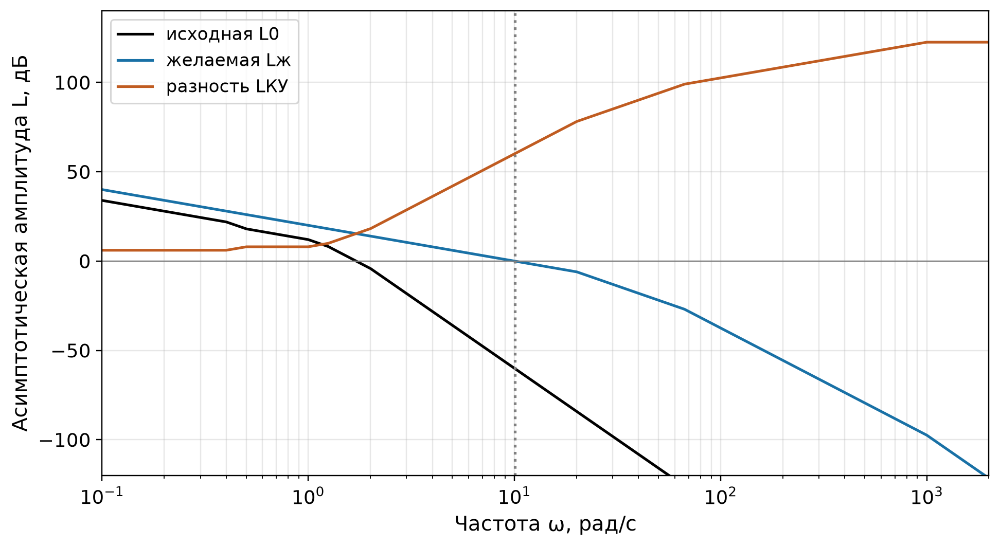
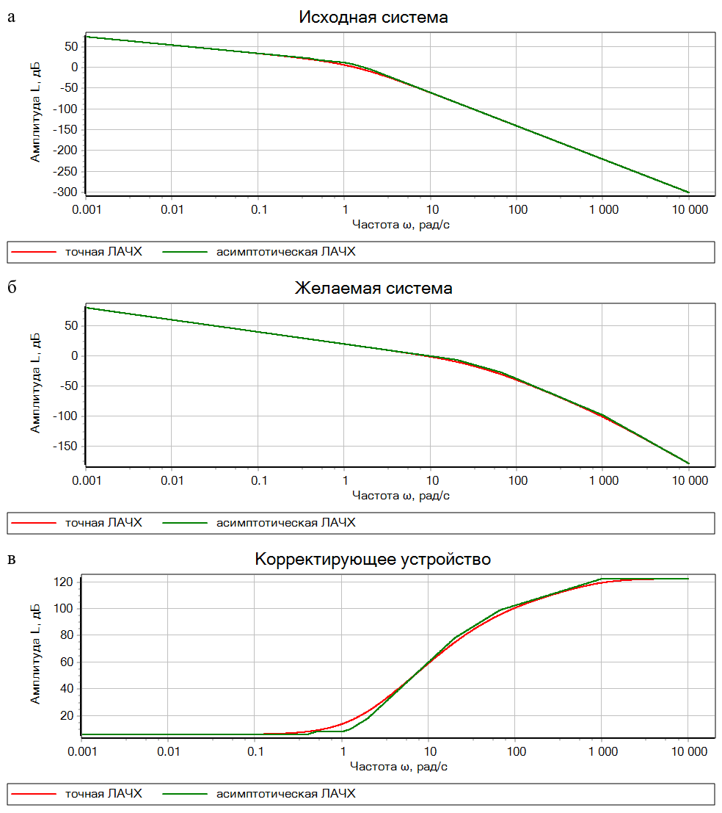
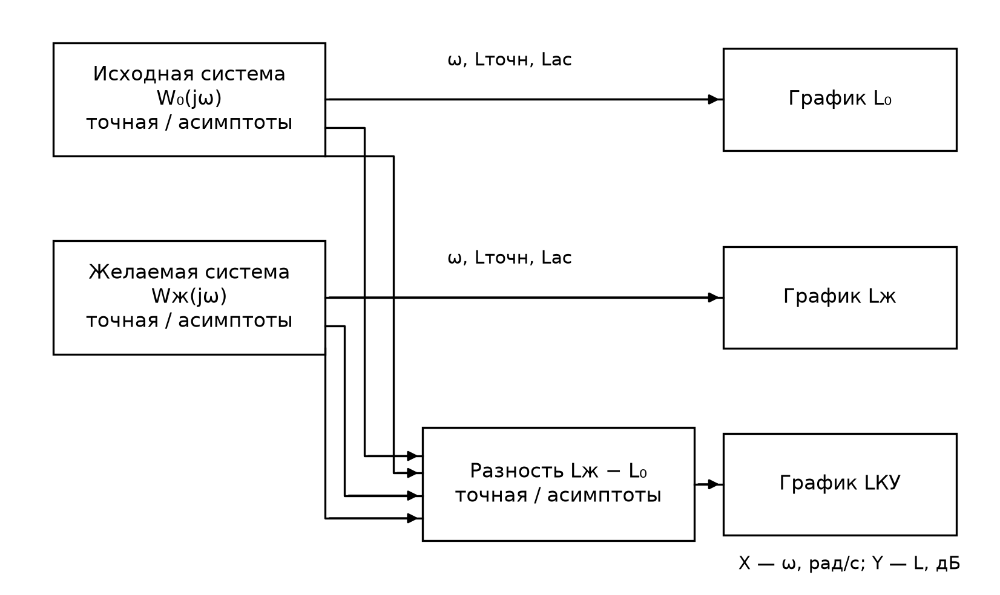
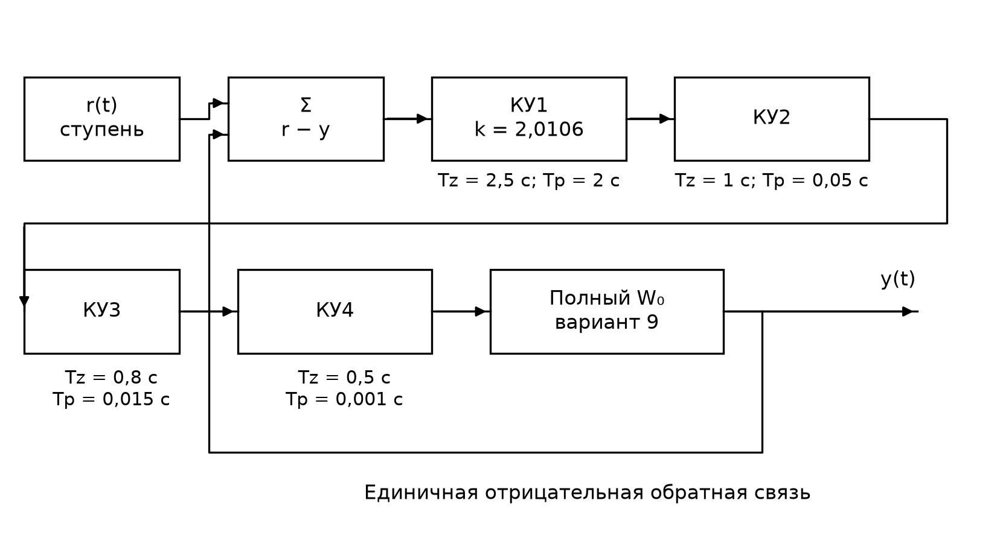
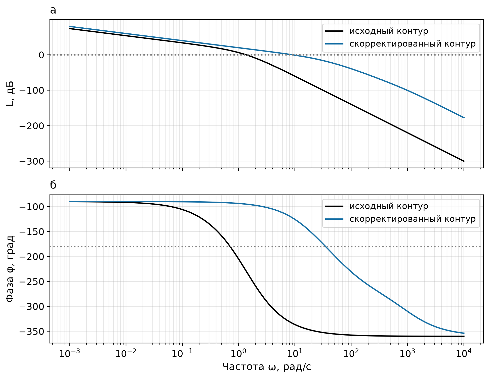
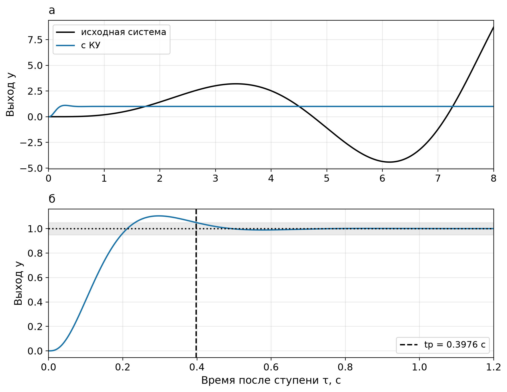
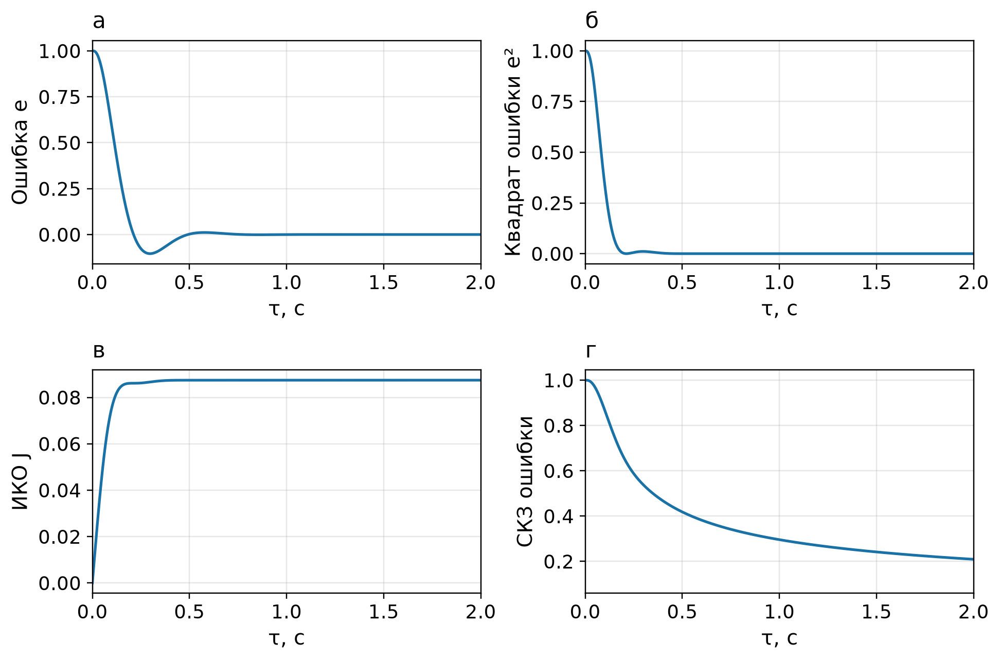
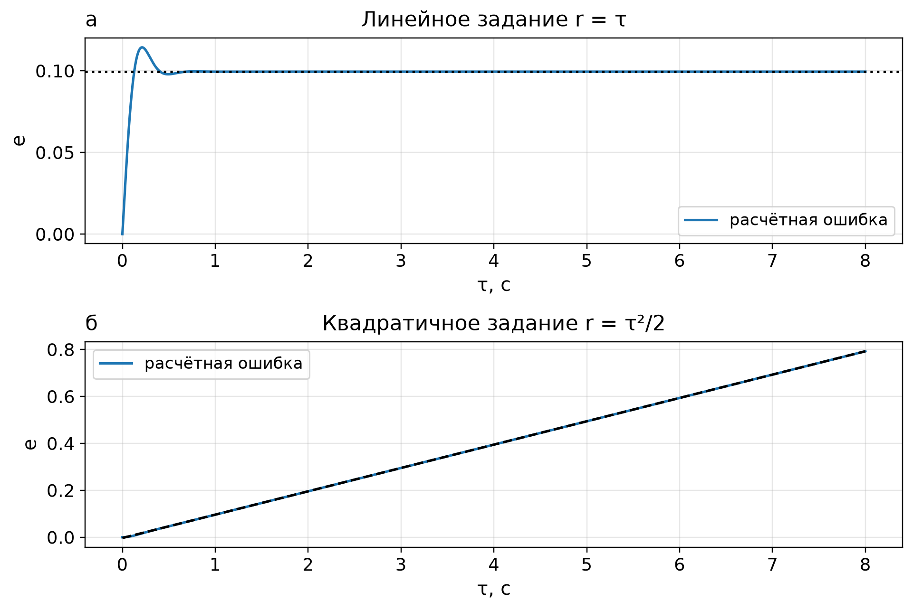
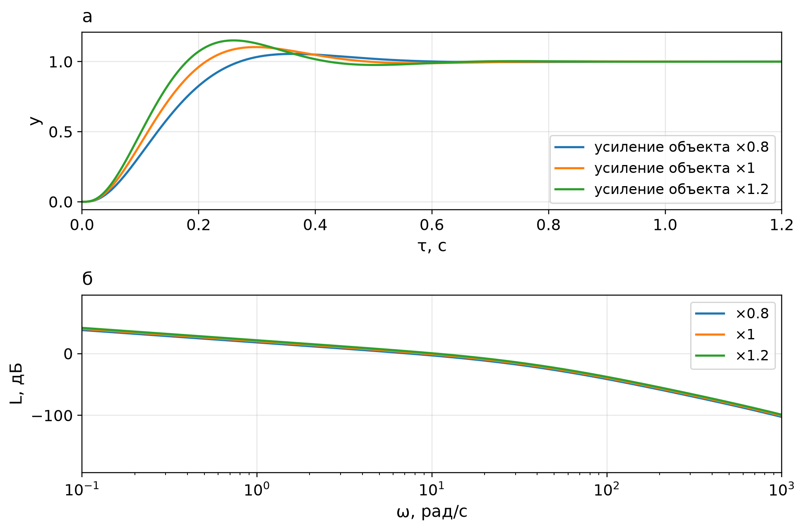

# Последовательная коррекция следящей системы

Расчётно-пояснительная записка к семинарскому заданию 3–4. Учебное руководство.

**Исполнители:** Косолапов И.Р., Ныркова Е.А., Тархов И.А.  
**Группа:** [указать]. **Дисциплина:** [указать официальное название].  
**Руководитель:** [указать]. МГТУ им. Н.Э. Баумана, 2026.

# ЗАДАНИЕ

Исследовать исходную следящую систему варианта 9. Спроектировать последовательное корректирующее устройство методом логарифмических амплитудно-частотных характеристик. Требования к реакции на единичное ступенчатое задание: время регулирования не более 0,5 с в полосе ±5 %, перерегулирование не более 15 %. Проверить запасы устойчивости по фазе не менее 30° и по амплитуде в пределах 6–20 дБ. Построить точные и асимптотические ЛАЧХ исходной системы, желаемой системы и корректирующего устройства. Подготовить схемы SimInTech, графики и пояснения к расчёту.

Результаты: пояснительная записка, частотная модель и динамическая модель последовательной коррекции. ПИД-регулятор и параллельная коррекция в объём настоящего этапа не входят. Срок выполнения и подписи: [заполнить].

# СОДЕРЖАНИЕ

Введение  
1 Исходные данные и анализ системы  
2 Проектирование последовательного КУ по ЛАЧХ  
3 Построение моделей в SimInTech  
4 Проверка качества и точности  
5 Реализация и ограничения  
Заключение  
Список использованных источников  
Приложение А. Файлы и воспроизводимость

# ПЕРЕЧЕНЬ ОБОЗНАЧЕНИЙ И СОКРАЩЕНИЙ

ИКО – интегральная квадратичная ошибка.

КУ – корректирующее устройство.

ЛАЧХ – логарифмическая амплитудно-частотная характеристика.

СКЗ – среднеквадратическое значение ошибки.

$e(t)$ – ошибка слежения.

$J(T)$ – интеграл квадрата ошибки на интервале $[0,T]$.

$L(\omega)$ – ЛАЧХ, дБ.

$t_p$ – время регулирования, с.

$W_0(s)$ – передаточная функция исходной разомкнутой системы.

$W_{\mathrm{ж}}(s)$ – передаточная функция желаемой разомкнутой системы.

$W_{\mathrm{КУ}}(s)$ – передаточная функция последовательного КУ.

$\sigma$ – перерегулирование, %.

$\varphi(\omega)$ – фаза, градусы.

$\Phi(s)$ – передаточная функция замкнутой системы по заданию.

$\omega$ – угловая частота, рад/с.

$\omega_c$ – частота среза, рад/с.

# ВВЕДЕНИЕ

Последовательное КУ включают в прямой канал следящей системы перед объектом. Оно изменяет частотные свойства разомкнутого контура и тем самым влияет на устойчивость, быстродействие и точность замкнутой системы.

В этом руководстве расчёт начинается с исходной характеристики и требований задания. Сначала строят желаемую ломаную ЛАЧХ, затем находят разность желаемой и исходной характеристик. Только после этого восстанавливают передаточные функции. Такой порядок позволяет объяснить, откуда берётся каждое звено коррекции, и проверить физическую реализуемость устройства.

Методические указания к семинарам 3–4 [1] определяют содержание расчёта. Исходные параметры взяты из прежней пояснительной записки [2]. Работа другого студента [3] используется как пример порядка представления материала: исходные данные, схемы, частотный анализ, переходный процесс, ошибки и выводы. Её коэффициенты не переносятся в данный вариант.

Асимптоты служат для синтеза. Точные характеристики и переходный процесс нужны для проверки результата: желаемая ломаная сама по себе не гарантирует допустимого перерегулирования. Поэтому в расчёте показано уточнение одного излома после проверки переходной характеристики.

Цель работы — получить последовательное КУ, которое обеспечивает заданные показатели качества, и объяснить порядок его проектирования по ЛАЧХ. Для этого необходимо исследовать исходный контур, построить желаемую ломаную, восстановить звенья КУ по разности характеристик, собрать модели в SimInTech и проверить устойчивость, переходный процесс и ошибки слежения.

# 1 Исходные данные и анализ системы

## 1.1 Передаточная функция и критерии

Для варианта 9 принимается передаточная функция исходного разомкнутого контура [2]:

$W_0(s)=\frac{5(2s+1)}{s(2{,}5s+1)(s+1)(0{,}8s+1)(0{,}5s+1)}.$

Замыкание выполняется единичной отрицательной обратной связью. Перед началом расчёта нужно различать разомкнутую и замкнутую функции: ЛАЧХ для синтеза относится к разомкнутому контуру, а показатели переходного процесса — к замкнутой системе.

Требования и способ их проверки приведены в таблице 1. Полоса регулирования отсчитывается от установившегося значения. Время измеряют от момента приложения ступени.

Таблица 1 — Критерии качества

| Показатель | Требование | Проверка |
|---|---|---|
| Время регулирования | $t_p\leq0{,}5$ с | Последний выход из полосы 0,95–1,05 |
| Перерегулирование | $\sigma\leq15$ % | Максимум переходной характеристики |
| Запас по фазе | Не менее 30° | На точной частоте среза |
| Запас по амплитуде | 6–20 дБ | На частоте фазы −180° |
| Ошибка на ступень | Нулевая | Устойчивый контур с астатизмом первого порядка |

В семинарских материалах формулировку требования к запасу по фазе следует уточнять по своему варианту. Здесь 30° принято нижней границей, как в исходной РПЗ [2].

## 1.2 Разложение на типовые звенья

Каждому множителю $Ts+1$ соответствует частота излома $\omega_b=1/T$. Множитель числителя увеличивает наклон на 20 дБ/дек, множитель знаменателя уменьшает его на 20 дБ/дек. Интегратор задаёт исходный наклон −20 дБ/дек.

В таблице 2 звенья расположены по возрастанию частоты. Изломы 0,4 и 0,5 рад/с близки; их нельзя объединять до построения характеристики.

Таблица 2 — Изломы исходной ЛАЧХ

| Частота, рад/с | Множитель | Изменение наклона, дБ/дек | Наклон после излома, дБ/дек |
|---|---|---|---|
| Ниже 0,4 | $5/s$ | — | −20 |
| 0,4 | $2{,}5s+1$ в знаменателе | −20 | −40 |
| 0,5 | $2s+1$ в числителе | +20 | −20 |
| 1 | $s+1$ в знаменателе | −20 | −40 |
| 1,25 | $0{,}8s+1$ в знаменателе | −20 | −60 |
| 2 | $0{,}5s+1$ в знаменателе | −20 | −80 |

Удобно строить асимптоты одной формулой. Введём функцию $q_T(\omega)=\max(0,\log_{10}(T\omega))$. Тогда

$Q_0(\omega)=q_{2{,}5}(\omega)+q_1(\omega)+q_{0{,}8}(\omega)+q_{0{,}5}(\omega),$

$L_{0,\mathrm{ас}}(\omega)=20\log_{10}(5/\omega)+20q_2(\omega)-20Q_0(\omega).$

Функция $q_T$ равна нулю до излома и линейно растёт после него в логарифмической шкале. Это даёт ломаную без сглаживания. Точная ЛАЧХ вычисляется отдельно:

$L_0(\omega)=20\log_{10}|W_0(j\omega)|.$

## 1.3 Устойчивость исходного контура

Для отрицательной обратной связи:

$\Phi_0(s)=\frac{W_0(s)}{1+W_0(s)}.$

Характеристический полином замкнутой системы равен

$s^5+4{,}65s^4+7{,}45s^3+4{,}8s^2+11s+5.$

Два корня находятся в правой полуплоскости: $s=0{,}3261\pm j1{,}1382$. Следовательно, исходная замкнутая система неустойчива. Для неё нельзя приписывать обычное конечное время регулирования или установившуюся ступенчатую ошибку.

Точная частота среза составляет 1,3582 рад/с, запас по фазе −48,99°, запас по амплитуде −12,13 дБ. Отрицательные запасы согласуются с анализом корней. Коррекция должна прежде всего обеспечить устойчивость, а затем требуемое качество.

# 2 Проектирование последовательного КУ по ЛАЧХ

## 2.1 Порядок синтеза

Расчёт выполняют в следующем порядке.

1) построить исходную асимптотическую ЛАЧХ по коэффициенту усиления, интегратору и всем изломам;
2) оценить частоту среза по требуемому быстродействию;
3) провести желаемый среднечастотный участок с наклоном −20 дБ/дек через точку среза;
4) продолжить желаемую характеристику в низкочастотную область с учётом астатизма и точности;
5) выбрать высокочастотные изломы, проверить конечный наклон и возможность реализации;
6) вычесть исходную ломаную из желаемой. По изменениям наклона разности восстановить звенья КУ;
7) рассчитать точные частотные характеристики и переходный процесс. При нарушении требований изменить ломаную и повторить проверку.

В этом порядке передаточная функция желаемой системы является результатом построения. Графическая методика даёт начальное приближение; заключение о качестве делают после численной проверки.

## 2.2 Частота среза и среднечастотный участок

Для предварительной оценки используется семинарское соотношение [1]:

$\omega_{c,\mathrm{ас}}\approx\frac{k\pi}{t_p}.$

При допустимом перерегулировании 15 % принимается $k=1{,}6$. Для $t_p=0{,}5$ с получаем

$\omega_{c,\mathrm{ас}}=\frac{1{,}6\pi}{0{,}5}=10{,}0531\ \text{рад/с}.$

Через точку $(10{,}0531;\,0\ \text{дБ})$ проводится участок с наклоном −20 дБ/дек. Его уравнение:

$L_{\mathrm{ж,ср}}(\omega)=20\log_{10}(\omega_{c,\mathrm{ас}}/\omega).$

В данном варианте этот участок продолжается до частоты 20 рад/с сверху и до низких частот снизу. Отдельного требования к допустимой ошибке на линейно растущее задание в исходных данных нет, поэтому дополнительные низкочастотные изломы не вводятся. Это частный случай построения: при заданной скоростной добротности сначала проверяют низкочастотный уровень и при необходимости соединяют его со средним участком.

## 2.3 Высокочастотные изломы и уточнение

На высоких частотах добавим три полюса, чтобы желаемая ЛАЧХ последовательно получила наклоны −40, −60 и −80 дБ/дек. Конечный наклон равен наклону исходной системы. Это обеспечивает равенство степеней числителя и знаменателя КУ.

Первое приближение содержит изломы 20, 40 и 1000 рад/с. После восстановления функции из этой ломаной расчёт даёт перерегулирование 15,151 %. Оно превышает допустимые 15 %, хотя время регулирования 0,427 с удовлетворяет заданию. Такое приближение принимать нельзя.

Перенесём второй излом с 40 до 66,6667 рад/с. Соответствующая постоянная времени уменьшится с 0,025 до 0,015 с. В области среза фазовое отставание уменьшается. После повторной проверки перерегулирование составляет 10,412 %, время регулирования 0,3976 с.

Итоговая желаемая ломаная имеет вид

$Q_{\mathrm{ж}}(\omega)=q_{0{,}05}(\omega)+q_{0{,}015}(\omega)+q_{0{,}001}(\omega),$

$L_{\mathrm{ж,ас}}(\omega)=20\log_{10}(10{,}05309649/\omega)-20Q_{\mathrm{ж}}(\omega).$

Общий график ломаных приведён на рисунке 1. Его следует читать слева направо: сначала низкочастотный уровень, затем пересечение 0 дБ, далее высокочастотные изломы.

Рисунок 1 — Исходная, желаемая и корректирующая асимптотические ЛАЧХ

## 2.4 Разность характеристик и восстановление звеньев

Последовательное включение означает $W_{\mathrm{ж}}=W_{\mathrm{КУ}}W_0$. Поэтому в децибелах

$L_{\mathrm{КУ,ас}}(\omega)=L_{\mathrm{ж,ас}}(\omega)-L_{0,\mathrm{ас}}(\omega).$

Разность вычисляют при одинаковых частотах. Нельзя вычитать значения из двух графиков с разными сетками или единицами частоты. Для точных характеристик отдельно выполняют $L_{\mathrm{КУ}}=L_{\mathrm{ж}}-L_0$.

В таблице 3 показана последовательность изменений наклона разности. Увеличение наклона на 20 дБ/дек даёт нуль КУ, уменьшение на 20 дБ/дек — полюс.

Таблица 3 — Чтение ЛАЧХ корректирующего устройства

| Частота излома, рад/с | Изменение наклона, дБ/дек | Множитель КУ |
|---|---|---|
| 0,4 | +20 | $2{,}5s+1$ в числителе |
| 0,5 | −20 | $2s+1$ в знаменателе |
| 1 | +20 | $s+1$ в числителе |
| 1,25 | +20 | $0{,}8s+1$ в числителе |
| 2 | +20 | $0{,}5s+1$ в числителе |
| 20 | −20 | $0{,}05s+1$ в знаменателе |
| 66,6667 | −20 | $0{,}015s+1$ в знаменателе |
| 1000 | −20 | $0{,}001s+1$ в знаменателе |

На низких частотах разность равна постоянной $20\log_{10}(10{,}05309649/5)=6{,}0666$ дБ. Отсюда коэффициент усиления КУ $K_{\mathrm{КУ}}=2{,}0106193$.

Теперь восстанавливаем функции из построенных ломаных:

$W_{\mathrm{ж}}(s)=\frac{10{,}05309649}{s(0{,}05s+1)(0{,}015s+1)(0{,}001s+1)}.$

$W_{\mathrm{КУ}}(s)=2{,}0106193\,\frac{(2{,}5s+1)(s+1)(0{,}8s+1)(0{,}5s+1)}{(2s+1)(0{,}05s+1)(0{,}015s+1)(0{,}001s+1)}.$

После сокращения множителей произведение должно дать именно $W_{\mathrm{ж}}$. Сокращение проверяют в расчёте, но исходный объект в динамической схеме сохраняют целиком. Тогда ошибки ввода параметров не будут скрыты заменой всей цепочки готовой функцией.

## 2.5 Точные ЛАЧХ и ограничения выбранной формы

Точные и асимптотические характеристики трёх звеньев, экспортированные из SimInTech, показаны на рисунке 2. У изломов точная кривая отклоняется от ломаной; это нормальное следствие поведения апериодического звена. Частоту среза и запасы устойчивости определяют по точной кривой.

Рисунок 2 — Точные и асимптотические ЛАЧХ: а – исходная система; б – желаемая система; в – КУ

В методических указаниях рекомендуется ограничивать наклон разности величиной 40 дБ/дек [1]. В полученном решении на участке 2–20 рад/с он равен +60 дБ/дек. Эта рекомендация не выполнена. Ломаная обеспечивает динамические требования, но приводит к большому высокочастотному усилению и требует активной реализации.

Если для своего варианта преподаватель требует именно пассивное КУ или строгое ограничение наклона 40 дБ/дек, данное решение не является завершением такого задания. На частоте среза выше 2 рад/с исходный наклон −80 дБ/дек и желаемый наклон −20 дБ/дек неизбежно дают разность +60 дБ/дек. Поэтому ограничение 40 дБ/дек нужно согласовать с требованием к быстродействию и заново провести синтез. Ограничение нельзя устранить изменением масштаба графика.

# 3 Построение моделей в SimInTech

## 3.1 Частотная схема

Для частотного анализа используется файл «01_ЛАЧХ.xprt». Формат XPRT является XML-форматом проекта SimInTech [4]. На схеме размещены три вычислительных блока и три блока «График Y от X». Структура показана на рисунке 3.

Рисунок 3 — Структура модели построения трёх ЛАЧХ в SimInTech

Блок «Исходная» вычисляет общую частотную сетку, точную ЛАЧХ объекта и его асимптоты. Блок «Желаемая» вычисляет характеристики восстановленной после синтеза желаемой системы. Блок «Разность» получает четыре массива: точный и асимптотический для каждого контура. На его выходе отдельно формируются две характеристики КУ.

Сетка содержит 1401 точку от $10^{-3}$ до $10^4$ рад/с:

$\omega_i=10^{-3+7(i-1)/(1401-1)},\quad i=1,\ldots,1401.$

Ось частот каждого графика должна быть логарифмической. По вертикали откладываются децибелы. Использование равномерного массива частот на линейной оси не даст привычную ЛАЧХ, даже если расчёт модулей верен.

При самостоятельном построении сначала настройте один график. Подайте массив частот на вход X, а точную ЛАЧХ на Y. Для второй кривой подайте тот же массив частот на X1 и асимптоты на Y1. Затем повторите настройки для желаемой системы и КУ. Подпишите серии «точная ЛАЧХ» и «асимптотическая ЛАЧХ».

В вычислительных блоках асимптоты реализованы непосредственно через суммы вкладов типовых звеньев. Для логарифма по основанию 10 используется отношение $\ln(x)/\ln(10)$. Формула с $\max(0,\log_{10}(T\omega))$ позволяет получить именно прямолинейные участки.

Точные кривые можно дополнительно проверить штатным блоком «Построение частотных характеристик» [5]. Его вход должен получать малое испытательное воздействие, выход исследуемой цепочки подают на второй вход анализатора. Для проверки разомкнутой функции временно размыкают обратную связь. Если оставить её замкнутой, анализатор исследует замкнутую передаточную функцию, которая не подходит для синтеза КУ.

## 3.2 Расположение блоков и соединений

В частотном проекте три графика расположены справа на отдельных уровнях. Два блока исходных вычислений находятся слева, блок разности — ниже них. Массивы частот подведены к нижним портам графиков по отдельным маршрутам. Четыре линии к блоку разности проходят через свободную область между вычислителями и графиками.

Провод должен входить в порт на границе блока. Нельзя протягивать его через прямоугольник соседнего звена или через подпись. Если при добавлении ответвления редактор построил прямой отрезок через блок, добавьте точки излома и перенесите отрезок в свободный коридор.

Для каскада КУ используйте левый вход и правый выход каждого звена. Обратную связь ведите ниже прямого канала. Оставляйте место под подписями коэффициентов. Перед сохранением схемы проверьте её при масштабе, в котором читаются все подписи, и убедитесь, что ни один промежуточный участок провода не проходит через корпус блока.

## 3.3 Динамическая схема последовательной коррекции

Для проверки переходного процесса используется проект «02_Последовательное_КУ.xprt». Его прямой канал состоит из сумматора ошибки, четырёх звеньев КУ и полного исходного объекта. На выходе подключён блок записи истории и график Y от X с линейной осью времени. Структура приведена на рисунке 4.

Рисунок 4 — Каскад последовательного КУ и отрицательная обратная связь

Задание — единичная ступень в момент $t_0=1$ с. В блоке «Язык программирования» она задаётся функцией step(1,0,1). Начальные состояния равны нулю. Для сопоставления с расчётными графиками используют время $\tau=t-t_0$.

Каскад состоит из звеньев

$C_1(s)=2{,}0106193\,\frac{2{,}5s+1}{2s+1},\qquad C_2(s)=\frac{s+1}{0{,}05s+1},$

$C_3(s)=\frac{0{,}8s+1}{0{,}015s+1},\qquad C_4(s)=\frac{0{,}5s+1}{0{,}001s+1}.$

В таблице 4 приведены коэффициенты для блоков «Передаточная функция общего вида». В SimInTech коэффициенты задаются по возрастанию степени переменной $s$ [6]. Нельзя переносить массивы из другой программы без проверки порядка.

Таблица 4 — Коэффициенты числителя b и знаменателя a

| Блок | b: от свободного члена | a: от свободного члена |
|---|---|---|
| КУ1 | 2,010619298; 5,026548246 | 1; 2 |
| КУ2 | 1; 1 | 1; 0,05 |
| КУ3 | 1; 0,8 | 1; 0,015 |
| КУ4 | 1; 0,5 | 1; 0,001 |
| Полный объект | 5; 10 | 0; 1; 4,8; 7,45; 4,65; 1 |

Например, нулевой первый коэффициент знаменателя объекта соответствует множителю $s$, а не отсутствующему полюсу. Для одноканального блока эти массивы задаются одной строкой матрицы. В файле проекта используется запись с двумя уровнями скобок.

Проверьте знак обратной связи: коэффициенты сумматора должны быть 1 и −1. У положительной обратной связи характеристический полином другой, и приведённые результаты к ней не относятся.

## 3.4 Настройки и контроль расчёта

Время моделирования — 8 с. Для отображения история выхода сохраняется с интервалом 0,005 с; контрольный CSV содержит значения на шагах расчёта. Максимальный шаг — $10^{-4}$ с. Используется метод Рунге–Кутты с контролем точности; относительная погрешность $10^{-8}$, абсолютная $10^{-10}$. Малый шаг нужен из-за постоянной времени 0,001 с, а также для измерения времени последнего выхода из полосы.

При проверке схемы действуйте последовательно: запустите модель, убедитесь, что время дошло до 8 с, откройте график выхода, увеличьте участок после приложения ступени, сравните максимум и время регулирования с таблицей 5. Для проверки алгебры можно временно добавить отдельный замкнутый контур с $W_{\mathrm{ж}}$; его выход должен совпасть с выходом каскада.

Штатный экспорт трёх частотных графиков выполнен из SimInTech. Научные графики в записке дополнительно построены независимым расчётным скриптом по тем же функциям. Такое сопоставление полезно для поиска ошибок параметров и единиц измерения. Состав файлов приведён в приложении А.

# 4 Проверка качества и точности

## 4.1 Точные частотные характеристики

Точные ЛАЧХ и фазы исходного и скорректированного контуров представлены на рисунке 5.

Рисунок 5 — Частотные характеристики: а – ЛАЧХ; б – фаза

Для выбранного КУ точная частота среза равна 9,0714 рад/с. Она отличается от асимптотической оценки 10,0531 рад/с: на частоте среза уже заметно влияние высокочастотных полюсов.

Запас по фазе равен 57,334°. Частота пересечения фазы −180° составляет 35,0285 рад/с; запас по амплитуде равен 18,000 дБ. Оба показателя удовлетворяют принятым требованиям.

Корни характеристического полинома замкнутой скорректированной системы:

$s_1=-999{,}9853,\quad s_2=-70{,}6917,\quad s_{3,4}=-7{,}9948\pm j11{,}2116.$

Все вещественные части отрицательны. Полюса исходного объекта, сокращённые в произведении, также устойчивы. Поэтому идеальное сокращение не скрывает неустойчивого внутреннего состояния.

## 4.2 Переходная характеристика

Замкнутая передаточная функция по заданию равна

$\Phi(s)=\frac{10{,}05309649}{0{,}00000075s^4+0{,}000815s^3+0{,}066s^2+s+10{,}05309649}.$

На рисунке 6 исходный неустойчивый процесс показан отдельно от скорректированного, чтобы рост исходной реакции не скрывал детали устойчивого процесса.

Рисунок 6 — Переходные характеристики: а – сравнение систем; б – реакция с КУ в полосе ±5 %

На расчётных графиках $\tau=0$ соответствует приложению ступени. Для модели SimInTech этот момент соответствует $t=1$ с. Максимум $y_{\max}=1{,}10412$ достигается через 0,297 с после ступени.

Показатели определяются как

$\sigma=100\,\frac{y_{\max}-y_\infty}{y_\infty},\qquad y_\infty=1,$

$t_p=\inf\{\tau:\ |y(u)-1|\leq0{,}05\ \text{для всех }u\geq\tau\}.$

Важно брать последний выход из полосы, а не первое попадание в неё. При колебательном процессе эти времена различаются.

Результаты приведены в таблице 5. Расчёт переходного процесса выполнен с сеткой 0,00005 с; последняя цифра времени регулирования зависит от дискретизации.

Таблица 5 — Проверка качества скорректированной системы

| Показатель | Результат | Требование | Итог |
|---|---|---|---|
| Время регулирования | 0,3976 с | Не более 0,5 с | Выполнено |
| Перерегулирование | 10,412 % | Не более 15 % | Выполнено |
| Запас по фазе | 57,334° | Не менее 30° | Выполнено |
| Запас по амплитуде | 18,000 дБ | 6–20 дБ | Выполнено |
| Ошибка на ступень | Стремится к нулю | Нулевая | Выполнено |

## 4.3 Ошибка и интегральные показатели

Для единичной отрицательной обратной связи передаточная функция ошибки по заданию равна

$S(s)=\frac{1}{1+W_{\mathrm{ж}}(s)}=1-\Phi(s).$

На ступень $e(\tau)=1-y(\tau)$. Чтобы сравнивать разные варианты коррекции, кроме максимума и времени регулирования можно вычислить квадрат ошибки, интеграл и среднеквадратическую ошибку. Эти величины показаны на рисунке 7.

Рисунок 7 — Показатели ошибки: а – ошибка; б – её квадрат; в – ИКО; г – СКЗ

Используются определения

$J(T)=\int_0^T e^2(\tau)\,d\tau,\qquad e_{\mathrm{СКЗ}}(T)=\sqrt{\frac{J(T)}{T}}.$

Средний квадрат ошибки равен $J(T)/T$. Для среднеквадратической ошибки требуется квадратный корень. Подмена этих показателей меняет единицы и численные значения.

Для горизонта $T=8$ с после приложения ступени получено $J=0{,}087423$ и $e_{\mathrm{СКЗ}}=0{,}104536$. При $T\to0$ выражение с делением на T заменяют предельным значением. Сравнивать интегральные показатели нужно при одинаковом входе и одинаковом горизонте.

В проекте SimInTech с конечным временем 8 с и ступенью в 1 с длительность реакции составляет 7 с. Для строгого сравнения значения на горизонте 8 с после ступени необходимо продлить модель до 9 с либо вычислить независимый показатель для 7 с. До приложения ступени ошибка равна нулю, но включение этой секунды в знаменатель СКЗ искусственно уменьшает показатель.

## 4.4 Линейное и квадратичное задание

Для устойчивого контура с одним интегратором скоростная добротность равна

$K_v=\lim_{s\to0}sW_{\mathrm{ж}}(s)=10{,}05309649.$

При линейном задании $r(\tau)=v\tau$ установившаяся ошибка

$e_\infty=\frac{v}{K_v}.$

Для $v=1$ единица/с она составляет 0,099472 единицы. Ошибка конечна, но не нулевая. Для квадратичного задания $r(\tau)=a\tau^2/2$ ошибка неограниченно растёт. Её ведущий член равен $a\tau/K_v$. Результаты для $v=a=1$ приведены на рисунке 8.

Рисунок 8 — Ошибки слежения: а – линейное задание; б – квадратичное

Это следствие первого порядка астатизма, а не потеря устойчивости. Растущее задание и переходный процесс на единичную ступень проверяют разные свойства системы. Для устранения скоростной ошибки нужен дополнительный интегратор или другой способ повышения точности, после чего требуется новый анализ устойчивости.

## 4.5 Флуктуационная ошибка

Колебательная ступенчатая ошибка является детерминированной. Называть её флуктуационной без случайного входного сигнала нельзя. Для оценки флуктуаций нужно задать место приложения шума и его спектральную плотность.

Если шум $n$ добавлен к измерению в обратной связи, выходная составляющая равна $Y_n(s)=-\Phi(s)N(s)$. Для белого шума с односторонней спектральной плотностью $S_n$ в квадрате единиц измеряемой величины на герц:

$D_y=S_n B_{\mathrm{экв}},\qquad B_{\mathrm{экв}}=\frac{1}{2\pi}\int_0^\infty|\Phi(j\omega)|^2\,d\omega.$

Для рассчитанной системы эквивалентная полоса составляет около 2,87526 Гц. Численная дисперсия зависит от заданного $S_n$. Поскольку плотность шума в исходных данных не указана, численную флуктуационную ошибку здесь не назначают. Если шум вводится перед объектом, его передаточная функция будет другой.

# 5 Реализация и ограничения

## 5.1 Активное усиление и RC-звенья

Степени числителя и знаменателя КУ одинаковы, поэтому оно является правильной рациональной функцией. Однако высокочастотное усиление велико:

$W_{\mathrm{КУ}}(\infty)=2{,}0106193\,\frac{2{,}5\cdot1\cdot0{,}8\cdot0{,}5}{2\cdot0{,}05\cdot0{,}015\cdot0{,}001}=1{,}3404\cdot10^6.$

Это ограничивает практическое применение идеальной модели: требуется проверять полосу усилителя, шум, насыщение, допустимый сигнал управления и погрешности коэффициентов. Эти параметры не заданы, поэтому расчёт является проектом линейного активного КУ, а не готовой аппаратной конструкцией.

Форму каждого форсирующего звена можно получить пассивной RC-цепью с нормировкой. Для последовательного соединения ветви $R_1\parallel C$ и резистора $R_2$, с выходом на $R_2$,

$H(s)=\frac{T_p}{T_z}\,\frac{1+T_zs}{1+T_ps},\quad T_z=R_1C,\quad T_p=(R_1\parallel R_2)C.$

Здесь $T_z>T_p$. Пассивная цепь ослабляет низкочастотный сигнал, а на высоких частотах её передача стремится к единице. Исходное звено КУ имеет другой абсолютный уровень усиления; одной пассивной цепью его воспроизвести нельзя.

При условном выборе $C=10$ мкФ расчёт сопротивлений даёт значения таблицы 6. Между звеньями требуются буферы, иначе нагрузка соседней цепи изменит постоянные времени. Указанные величины не являются подбором стандартных номиналов.

Таблица 6 — Параметры нормированных RC-звеньев

| Звено | $T_z$, с | $T_p$, с | $R_1$, кОм | $R_2$, кОм |
|---|---|---|---|---|
| 1 | 2,5 | 2 | 250 | 1000 |
| 2 | 1 | 0,05 | 100 | 5,263 |
| 3 | 0,8 | 0,015 | 80 | 1,529 |
| 4 | 0,5 | 0,001 | 50 | 0,1002 |

Общее низкочастотное ослабление четырёх нормированных звеньев равно $1{,}5\cdot10^{-6}$. Для получения рассчитанного КУ понадобилось бы дополнительное усиление около $1{,}34\cdot10^6$. Таким образом, нормировка подтверждает необходимость активного устройства и не превращает расчёт в пассивное решение.

## 5.2 Чувствительность к изменению усиления

Идеальное сокращение полюсов объекта нулями КУ требует точного знания его параметров. В реальном устройстве постоянные времени меняются, и точного сокращения может не быть.

На рисунке 9 показана простая проверка: коэффициент усиления разомкнутого контура изменён на −20 % и +20 % при неизменных постоянных времени.

Рисунок 9 — Влияние усиления: а – переходный процесс; б – ЛАЧХ

Эта проверка показывает влияние только одного параметра. Она не доказывает устойчивость при любых изменениях объекта. Для аппаратного проекта отдельно варьируют постоянные времени, добавляют ограничения усилителя и оценивают сигнал управления. При большом высокочастотном усилении последний особенно важен.

# ЗАКЛЮЧЕНИЕ

Последовательное КУ рассчитано методом ЛАЧХ. Исходная система разложена на типовые звенья, по требуемому быстродействию выбран среднечастотный участок желаемой ломаной, затем добавлены высокочастотные изломы. Разность желаемой и исходной ЛАЧХ определила коэффициент усиления, нули и полюса корректирующего устройства.

Первое приближение не прошло проверку перерегулирования. Перенос второго высокочастотного излома с 40 до 66,6667 рад/с дал время регулирования 0,3976 с и перерегулирование 10,412 %. Запас по фазе составляет 57,334°, запас по амплитуде — 18,000 дБ. Для идеальной линейной модели принятые динамические требования выполнены.

В SimInTech подготовлена схема трёх частотных характеристик с точными кривыми и асимптотами, а также каскад четырёх звеньев КУ перед полным исходным объектом. Соединения разведены через порты и свободные области схем.

Полученный КУ требует активного усиления. Наклон его ЛАЧХ на участке 2–20 рад/с превышает рекомендацию 40 дБ/дек, а высокочастотный коэффициент составляет около $1{,}34\cdot10^6$. Эти ограничения следует учитывать при переходе от учебной линейной модели к аппаратной реализации.

# СПИСОК ИСПОЛЬЗОВАННЫХ ИСТОЧНИКОВ

1. Семинарские задания 3–4 «Анализ и коррекция следящей системы». 2025–2026. Электронный учебный материал, предоставленный для расчёта.
2. Косолапов И.Р., Ныркова Е.А., Тархов И.А. РПЗ «Корректирующее устройство». Файл «РПЗ_Корректирующее_устройство.docx». Исходная работа.
3. Семинарская работа. Файл «РТ1-81_Худорож_семинар3+4 (2).docx». Пример последовательности представления результатов.
4. SimInTech. Расширения файлов, создаваемых SimInTech. URL: https://help.simintech.ru/3_ustanovka_i_registraciya/svedenija_o_fajlah_i_katalogah/DAT_rasshirenija_fajlov_sozdavaemyh_SimInTech.html (дата обращения: 03.10.2026).
5. SimInTech. Построение частотных характеристик. URL: https://help.simintech.ru/10_biblioteki_blokov/avtomatika/Analiz_i_optimizaciya/Bloki/ao_postroenie_chastotnyh_harakteristik.html (дата обращения: 03.10.2026).
6. SimInTech. Передаточная функция общего вида. URL: https://help.simintech.ru/10_biblioteki_blokov/avtomatika/Dinamicheskie/com_peredatochnaya_funkciya_obshchego_vida.html (дата обращения: 03.10.2026).

# ПРИЛОЖЕНИЕ А

Файлы и воспроизводимость

Папка «Отчёты» содержит итоговые версии записки и иллюстрации. Три исходных документа сохранены в подпапке «Исходные». Папка «Рабочие файлы» содержит схемы, расчётные скрипты и материалы проверки.

В подпапке «Схемы» находятся проекты «01_ЛАЧХ.xprt» и «02_Последовательное_КУ.xprt». В подпапке «Расчёт» находятся скрипты calculate.py и build_models.py, файл metrics.json и контрольные таблицы reference_frequency.csv и reference_step.csv. Для воспроизведения независимого расчёта требуются Python, NumPy, SciPy и Matplotlib. Расчёт не использует параметры желаемой системы из работы другого студента.

В подпапке «Проверка» сохранены штатные экспорты частотных графиков из SimInTech. При изменении желаемой ломаной необходимо обновить её изломы в вычислительном блоке, затем повторно восстановить КУ и изменить коэффициенты динамического каскада. Редактирование только одной модели нарушит согласованность частотной и динамической частей.

Перед сдачей заполните реквизиты титульного листа и задания, сверяйте требования со своим вариантом и обновляйте содержание в Word целиком. Числа в таблице 5 относятся к указанной идеальной модели; они не являются гарантией качества аппаратного устройства.
