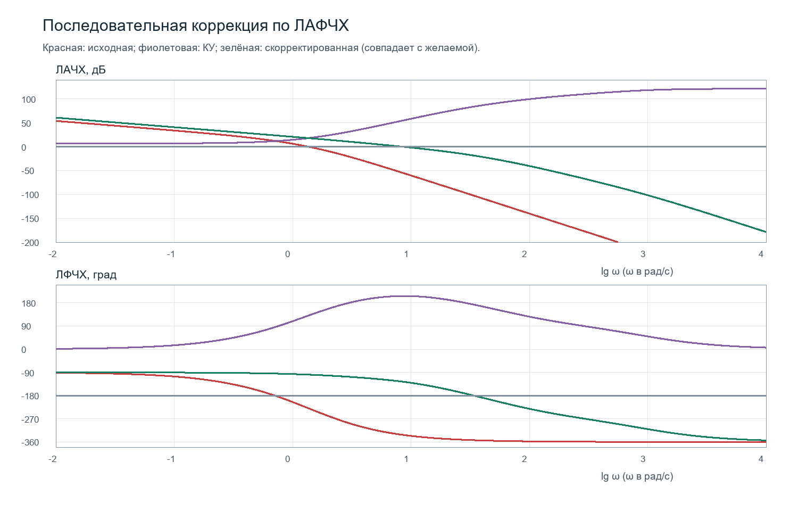
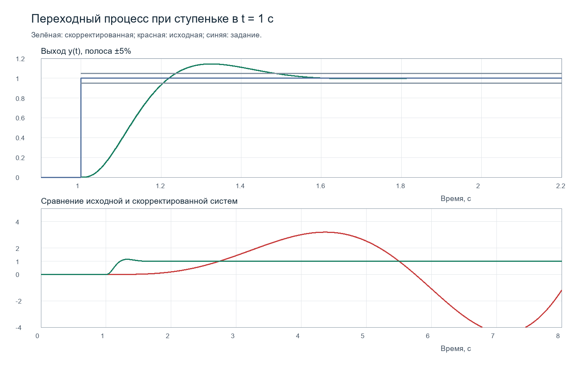

# Последовательная коррекция следящей системы по ЛАФЧХ

## 1. Результат и исходная система

Для полной системы варианта 9 синтезировано последовательно включённое корректирующее устройство. На номинальной линейной модели расчёт даёт время регулирования **0,48315 с** при полосе ±5%, перерегулирование **14,4399%**, запас устойчивости по амплитуде **18,5595 дБ** и по фазе **54,1171°**. Статическая ошибка при единичной ступеньке равна нулю.

Основной источник — предоставленный отчёт `RT1-81_Zhurav_Sem3+Sem4.docx`. Для расчёта выбрана полная передаточная функция варианта 9, согласованная с пользователем:

$$
W_0(p)=\frac{5(2p+1)}{p(2{,}5p+1)(p+1)(0{,}8p+1)(0{,}5p+1)}.
$$

Единичная отрицательная обратная связь, нулевые начальные условия и непрерывная линейная система без ограничений исполнительного устройства предполагаются во всём расчёте. Сигнал задания — единичная ступенька в момент $t_0=1$ с. Все показатели быстродействия отсчитываются от $t_0$.

Принятые требования:

| Показатель | Ограничение |
|---|---:|
| Время регулирования, полоса ±5% | $t_р\leq0{,}5$ с |
| Перерегулирование | $\sigma\leq15\%$ |
| Запас по амплитуде | $6\leq\Delta L\leq20$ дБ |
| Запас по фазе | $\Delta\varphi\geq30^\circ$ |

Выражение «до 30°» в исходном отчёте трактуется как требование минимального запаса 30°, что согласуется с дальнейшим изложением этого отчёта. Требования к времени и перерегулированию трактуются как верхние границы, а не как необходимость точного равенства.

## 2. Что необходимо исправить в исходном отчёте

1. В разделе 2 одновременно фигурируют разные объекты. Полная формула варианта 9 содержит четыре инерционные постоянные времени; в схемах ПИД-регулятора отсутствуют звенья с $T_4=0{,}8$ и $T_5=0{,}5$ с; на другом рисунке объект состоит только из двух инерционных звеньев. Параметры, рассчитанные для одного из этих объектов, нельзя автоматически переносить на другой.
2. Для последовательной коррекции используется **разность $L_К=L_ж-L_0$**. Формула с обратным знаком, приведённая в разделе о местной обратной связи, относится к другому способу коррекции.
3. Запасы устойчивости замкнутой системы определяют по передаточной функции разомкнутого контура $W_КW_0$. Блок частотного анализа, подключённый к входу задания и выходу замкнутой схемы, исследует $W/(1+W)$ и не даёт нужную характеристику петли. Это прямо оговорено в [справке SimInTech](https://help.simintech.ru/10_biblioteki_blokov/avtomatika/Analiz_i_optimizaciya/Bloki/AO_postroenie_chastotnyh_harakteristik.html).
4. Для параметров отчёта $K=11$, $T_1=0{,}25$, $T_2=0{,}2$, $T_3=0{,}06$, $T_4=0{,}01$, $T_5=0{,}001$ с получаются $\sigma=15{,}5725\%$, $t_р=0{,}5036$ с, $\Delta\varphi=53{,}0769^\circ$, $\Delta L=20{,}8642$ дБ. Следовательно, значения 93° и точное выполнение всех ограничений этими параметрами расчётом не подтверждаются.
5. Интегратор в разомкнутой системе означает астатизм и отсутствие ограниченного установившегося отклика на ступеньку. Сам по себе он не доказывает наличие полюсов в правой полуплоскости. В полной исходной **замкнутой** системе неустойчивость действительно есть и подтверждается расчётом корней.
6. Среднее квадрата ошибки $\frac1T\int_0^T e^2dt$ и среднеквадратическая ошибка $\sqrt{\frac1T\int_0^T e^2dt}$ — разные величины. Остаточные детерминированные колебания без случайного возмущения также не являются оценкой случайной флюктуационной ошибки.
7. Для системы первого порядка астатизма ошибка при квадратичном задании растёт **линейно** во времени, а не квадратично. Малый масштаб задания уменьшает величину ошибки, но не изменяет её порядок роста.

## 3. Анализ нескорректированной системы

Подстановка $p=j\omega$ даёт:

$$
L_0(\omega)=20\lg5-20\lg\omega+
10\lg(1+4\omega^2)-10\lg(1+6{,}25\omega^2)
-10\lg(1+\omega^2)-10\lg(1+0{,}64\omega^2)-10\lg(1+0{,}25\omega^2),
$$

$$
\varphi_0(\omega)=-90^\circ+\arctan(2\omega)
-\arctan(2{,}5\omega)-\arctan(\omega)
-\arctan(0{,}8\omega)-\arctan(0{,}5\omega).
$$

В фазовой формуле арктангенсы выражены в градусах. Частоты сопряжения: 0,4; 0,5; 1; 1,25; 2 рад/с. Начальный наклон асимптотической ЛАЧХ составляет −20 дБ/дек, конечный — −80 дБ/дек.

Для единичной отрицательной обратной связи:

$$
\Phi_0(p)=\frac{W_0(p)}{1+W_0(p)}
=\frac{10p+5}{p^5+4{,}65p^4+7{,}45p^3+4{,}8p^2+11p+5}.
$$

Корни характеристического полинома:

- $0{,}326085\pm j1{,}138210$;
- $-2{,}399647\pm j1{,}155122$;
- $-0{,}502877$.

Два корня находятся справа от мнимой оси: система неустойчива. Для разомкнутого контура получены $\omega_{с0}=1{,}35817$ рад/с, $\Delta\varphi_0=-48{,}9913^\circ$, $\Delta L_0=-12{,}1285$ дБ. Эти отрицательные значения согласуются с потерей устойчивости при замыкании.

## 4. Построение желаемой ЛАФЧХ

За основу взята структура желаемой передаточной функции из семинара 3. Начальный участок −20 дБ/дек сохраняет первый порядок астатизма, а участок с небольшим отрицательным наклоном около частоты среза обеспечивает требуемое быстродействие и фазовый запас. Высокочастотные полюса ограничивают полосу.

После проверки исходного набора уточнены две постоянные времени: $T_3$ уменьшена с 0,06 до 0,05 с, а $T_4$ увеличена с 0,01 до 0,015 с. Окончательный набор:

| Параметр | Значение |
|---|---:|
| $K_ж$ | 11 |
| $T_{1ж}$ | 0,25 с |
| $T_{2ж}$ | 0,2 с |
| $T_{3ж}$ | 0,05 с |
| $T_{4ж}$ | 0,015 с |
| $T_{5ж}$ | 0,001 с |

$$
W_ж(p)=\frac{11(0{,}2p+1)}{p(0{,}25p+1)(0{,}05p+1)(0{,}015p+1)(0{,}001p+1)}.
$$

Частоты сопряжения желаемой асимптотической ЛАЧХ:

| Диапазон частот, рад/с | Наклон, дБ/дек |
|---|---:|
| $0<\omega<4$ | −20 |
| $4<\omega<5$ | −40 |
| $5<\omega<20$ | −20 |
| $20<\omega<66{,}6667$ | −40 |
| $66{,}6667<\omega<1000$ | −60 |
| $\omega>1000$ | −80 |

Частота среза 8,44634 рад/с находится на участке 5–20 рад/с. Около этой частоты точная фаза равна −125,8829°, поэтому запас составляет 54,1171°. Асимптоты используются при синтезе, а показатели качества проверяются по **точным** частотным и временным характеристикам.

## 5. Синтез последовательного корректирующего устройства

Структура:

```text
r → [Σ: e=r−y] → [WК(p)] → [W0(p)] → y
         ↑                            │
         └──────── отрицательная ОС ─┘
```

Здесь $W_0$ сохраняет исходные параметры. Требуемое изменение контура достигается включением отдельного устройства $W_К$ перед объектом:

$$
W_К(p)=\frac{W_ж(p)}{W_0(p)},\qquad
L_К(\omega)=L_ж(\omega)-L_0(\omega),\qquad
\varphi_К(\omega)=\varphi_ж(\omega)-\varphi_0(\omega).
$$

Получена реализуемая передаточная функция:

$$
\boxed{W_К(p)=2{,}2\,
\frac{(0{,}2p+1)(2{,}5p+1)(p+1)(0{,}8p+1)(0{,}5p+1)}
{(2p+1)(0{,}25p+1)(0{,}05p+1)(0{,}015p+1)(0{,}001p+1)}}.
$$

Степени числителя и знаменателя равны. Идеальные дифференциаторы не нужны: устройство составлено из пяти звеньев с конечным высокочастотным коэффициентом передачи. Все его полюса устойчивы: −0,5; −4; −20; −66,6667; −1000 с⁻¹.

Для каскадной реализации:

| Звено | Передаточная функция | Блок SimInTech |
|---|---|---|
| C1 | $2{,}2(0{,}2p+1)/(2p+1)$ | Передаточная функция общего вида |
| C2 | $(2{,}5p+1)/(0{,}25p+1)$ | Инерционно-форсирующее звено |
| C3 | $(p+1)/(0{,}05p+1)$ | Инерционно-форсирующее звено |
| C4 | $(0{,}8p+1)/(0{,}015p+1)$ | Инерционно-форсирующее звено |
| C5 | $(0{,}5p+1)/(0{,}001p+1)$ | Инерционно-форсирующее звено |

В инерционно-форсирующем звене параметр `T1` относится к числителю, `T2` — к знаменателю. Начальные состояния всех звеньев заданы нулевыми.

Низкочастотное усиление КУ равно 2,2, то есть 6,84845 дБ. Асимптотическая ЛАЧХ КУ начинается горизонтально. При прохождении нуля наклон увеличивается на 20 дБ/дек, при прохождении полюса уменьшается на 20 дБ/дек. Последовательность частот нулей и полюсов: 0,4 (нуль), 0,5 (полюс), 1 (нуль), 1,25 (нуль), 2 (нуль), 4 (полюс), 5 (нуль), 20 (полюс), 66,6667 (полюс), 1000 (полюс).

На номинальной модели $W_КW_0=W_ж$ точно. Компенсируются только устойчивые полюса и устойчивый нуль исходного объекта; интегратор $1/p$ в контуре сохраняется.



## 6. Коэффициенты для ввода одним блоком

Для ввода в блок SimInTech «Передаточная функция общего вида» коэффициенты ниже записаны **по возрастанию степеней $p$**, начиная со свободного члена. `b` — числитель, `a` — знаменатель. Нули в начале массива для интегратора сохраняются. Для звена C1: `b = [2.2, 0.44]`, `a = [1, 2]`, `y0 = [0]`.

Исходный объект:

```text
b = [5, 10]
a = [0, 1, 4.8, 7.45, 4.65, 1]
```

Корректирующее устройство:

```text
b = [2.2, 11, 18.502, 13.508, 4.246, 0.44]
a = [1, 2.316, 0.649315, 0.0348345, 0.0004091875, 0.000000375]
```

Желаемая разомкнутая система:

```text
b = [11, 2.2]
a = [0, 1, 0.316, 0.017315, 0.0002045, 0.0000001875]
```

Замкнутая желаемая система:

```text
b = [11, 2.2]
a = [11, 3.2, 0.316, 0.017315, 0.0002045, 0.0000001875]
```

Для численного моделирования предпочтительна предоставленная каскадная схема: коэффициенты её звеньев лучше обусловлены, чем полином пятого порядка с сильно различающимися коэффициентами.

## 7. Реализация в SimInTech

### Переходные процессы

Откройте `Sequential_correction.prt` или XML-версию `Sequential_correction.xprt`. Схема содержит три независимых замкнутых контура с одинаковыми источниками ступеньки:

1. **Скорректированный:** сумматор → C1…C5 → полный исходный объект → единичная отрицательная обратная связь.
2. **Исходный:** полный исходный объект с единичной отрицательной обратной связью, без КУ.
3. **Желаемый:** $W_ж$ с единичной отрицательной обратной связью — контрольный эталон.

Исходный объект в первом и втором контурах собран из $5/p$, инерционного звена с $T=2{,}5$, инерционно-форсирующего звена $(2p+1)/(p+1)$ и инерционных звеньев с $T=0{,}8$ и $T=0{,}5$ с.

Временные графики:

- `Corrected_and_desired`: совпадение фактического и желаемого выходов;
- `Before_and_after`: сравнение исходной и скорректированной систем;
- `Tracking_error`: ошибки скорректированного и желаемого контуров.

Блок `Export_results` записывает строки `t r y y_desired y_original u` в `simulation_native.dat`, где $u$ — сигнал между КУ и объектом. В поставляемой версии путь направлен в папку `outputs`; при переносе проекта в другую папку его следует изменить на доступный путь.

Параметры расчёта: начало 0 с, конец 8 с, RK45, максимальный шаг 0,0001 с, минимальный 10⁻⁷ с, относительная точность 10⁻⁸, абсолютная 10⁻¹⁰. Шаг записи — 0,0005 с. Малый максимальный шаг нужен из-за постоянной времени 0,001 с.

### Частотные характеристики

Откройте `Frequency_analysis.prt` или `Frequency_analysis.xprt`. Четыре **разомкнутые** ветви исследуют $W_0$, $W_К$, $W_КW_0$ и $W_ж$. Откройте соответствующий блок `Bode_original`, `Bode_C`, `Bode_corrected` или `Bode_desired` двойным щелчком после инициализации.

В блоках выбраны ЛАХ и ФЧХ, диапазон 0,0001–10000 рад/с, 6000 точек, расчёт в начале моделирования и понижение степеней для совпадающих устойчивых корней. Последняя настройка облегчает частотный анализ каскада; физические звенья остаются в исходной схеме.

Вычисляйте запасы по разомкнутой ветви `Bode_corrected`: при $L=0$ используйте $180^\circ+\varphi$, а при $\varphi=-180^\circ$ — $-L$. Если программа отображает фазу по модулю 360°, перед анализом выберите непрерывную ветвь фазы.

Частота в этих блоках — круговая $\omega$ в рад/с; подставлять Гц вместо неё нельзя. Частоте среза соответствует $f_c=\omega_c/(2\pi)\approx1{,}3443$ Гц.

## 8. Проверка показателей качества

Скорректированная замкнутая передаточная функция:

$$
\Phi_с(p)=\frac{W_ж(p)}{1+W_ж(p)}
=\frac{2{,}2p+11}
{1{,}875\cdot10^{-7}p^5+2{,}045\cdot10^{-4}p^4+0{,}017315p^3+0{,}316p^2+3{,}2p+11}.
$$

Её полюса:

- −999,987184;
- −70,194144;
- −7,377238 ± j9,561182;
- −5,730862.

Все корни имеют отрицательные вещественные части. Несокращённая каскадная реализация также содержит устойчивые компенсированные внутренние моды; проверка устойчивости только сокращённой функции была бы недостаточна при компенсации неустойчивых звеньев, но здесь таких компенсаций нет.

| Показатель | Получено | Требование |
|---|---:|---:|
| Перерегулирование | 14,4399% | ≤15% |
| Время регулирования, ±5% | 0,48315 с | ≤0,5 с |
| Частота среза | 8,44634 рад/с | — |
| Запас по фазе | 54,1171° | ≥30° |
| Частота пересечения −180° | 33,8886 рад/с | — |
| Запас по амплитуде | 18,5595 дБ | 6–20 дБ |
| Статическая ошибка на ступеньку | 0 | — |
| ИКО $\int_0^\infty e^2dt$ | ≈0,0941135 | — |

Максимум выходного сигнала равен 1,144399 и достигается через 0,32485 с после ступеньки, то есть около $t=1{,}32485$ с на абсолютной шкале. Последний выход из полосы $[0{,}95;1{,}05]$ происходит около $t=1{,}48315$ с. Поэтому $t_р=1{,}48315-1=0{,}48315$ с.



Для точности слежения:

$$
K_v=\lim_{p\to0}pW_ж(p)=11,\qquad e_{уст,\text{линейное}}=\frac{v}{11}.
$$

При единичной скорости задания установившаяся ошибка равна 0,090909. Для $r(\tau)=a\tau^2/2$, $\tau=t-t_0$, ошибка имеет ведущий член $a\tau/11$. Нулевая ошибка на ступеньку не означает нулевую ошибку при любом законе задания.

## 9. Область применимости

Решение выполняет принятые требования для номинального линейного объекта. Коррекция основана на компенсации его известных устойчивых звеньев, поэтому при изменении постоянных времени точное равенство $W_КW_0=W_ж$ нарушается. Запасы устойчивости не заменяют отдельной проверки параметрической робастности.

Высокочастотное усиление устройства достаточно велико:

$$
W_К(\infty)=\frac{0{,}44}{3{,}75\cdot10^{-7}}\approx1{,}17333\cdot10^6.
$$

При идеальной единичной ступеньке и нулевых состояниях это же значение является мгновенным начальным значением $u(1^+)$. Такая схема пригодна для учебного линейного синтеза, но для реального исполнительного устройства потребуются ограничения управления, модель датчика и шума, а затем повторный синтез и проверка. В исходных данных пределы $u$ не заданы; насыщение в представленные расчёты не включено.

## 10. Состав файлов и воспроизводимость

- `Sequential_correction.prt` и `Sequential_correction.xprt` — основная схема переходных процессов в двоичном и XML-форматах SimInTech.
- `Frequency_analysis.prt` и `Frequency_analysis.xprt` — схема разомкнутого частотного анализа.
- `coefficients.json` — коэффициенты передаточных функций отдельно в порядке для NumPy и в порядке для SimInTech.
- `verification.json` — точные расчётные показатели и статус проверки в SimInTech.
- `step_reference.csv`, `frequency_reference.csv` — независимые численные эталоны.
- `simulation_native.dat` — фактический результат расчётного ядра SimInTech, столбцы `t r y y_desired y_original u`, разделитель — табуляция.
- `frequency_native.csv` — фактические ЛАХ и ФЧХ, извлечённые из блоков частотного анализа SimInTech.
- `step_response.png`, `bode.png` — расчётные графики.

Независимая проверка выполнена по полиномам: корни найдены численно, переходная характеристика восстановлена по полюсам и вычетам, частоты пересечения определены методом бисекции, время регулирования оценено на сетке 50 мкс. Для проверки $W_КW_0=W_ж$ использовано прямое перемножение комплексных частотных функций без предварительного сокращения; относительная ошибка меньше 10⁻¹⁰ на контрольной сетке.

**Проверка в установленном SimInTech выполнена:** обе схемы успешно инициализированы и рассчитаны штатным ядром версии 2.24.4.3 x64. Основная схема прошла до 8.000016 с; записано 16001 строк. По записи SimInTech получены перерегулирование **14.439897%** и время установления в полосе ±5% **0.483516 с** после ступеньки. Отличие последнего значения от расчёта на сетке 50 мкс объясняется шагом записи 0,5 мс.

Максимальное расхождение каскада КУ + полного объекта с желаемой ветвью составляет 2e-13; с независимым интерполированным эталоном — 3.82e-07. По 6001 точкам частотного анализа максимальное отличие от аналитической ЛАЧХ составляет 2.9e-06 дБ, от ЛФЧХ — 1.92e-05°. Интерполяция данных SimInTech даёт запас по фазе 54.1171° и по амплитуде 18.5595 дБ.

При самостоятельном запуске выполните инициализацию, дождитесь её завершения, затем включите расчёт. Результаты временных графиков формируются при новом запуске; файлы `simulation_native.dat` и `frequency_native.csv` сохраняют подтверждение уже выполненной проверки.

### Ограничение проверки интерфейса

Численная проверка расчётного ядра выполнена успешно. При открытии схемы в интерфейсе установленного SimInTech в журнале остаются сообщения об ошибках. Доступный канал чтения интерфейса показывает тип сообщений без полного текста; их причины не установлены. Это ограничение не следует скрывать: проверенное совпадение результатов подтверждается файлами `simulation_native.dat`, `frequency_native.csv` и `verification.json`, но отсутствие сообщений об ошибках при визуальном открытии не подтверждено.
